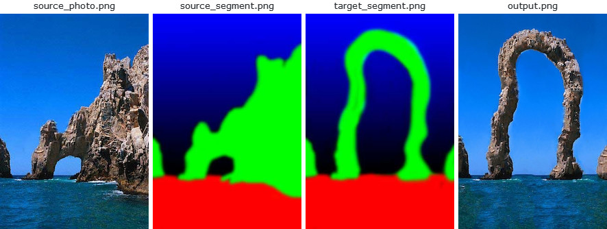
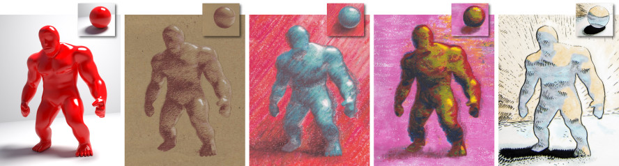
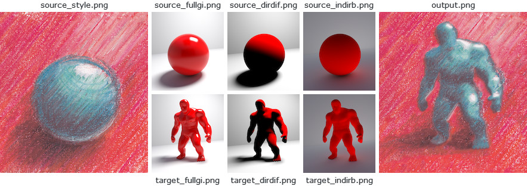
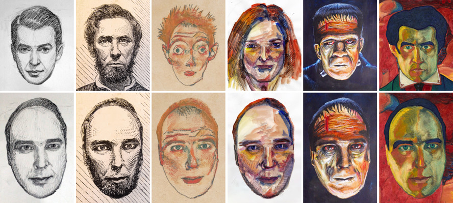
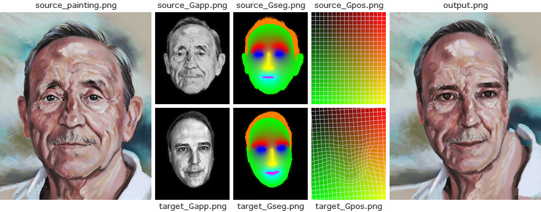

# Ebsynth: A Fast Example-based Image Synthesizer

`ebsynth` is a versatile tool for by-example synthesis of images.
It can be used for a variety of image synthesis tasks, including guided
texture synthesis, artistic style transfer, content-aware inpainting
and super-resolution.

The focus of `ebsynth` is on preserving the fidelity of the source material.
Unlike other recent approaches, `ebsynth` doesn't rely on neural networks.
Instead, it uses a state-of-the-art implementation of non-parametric
texture synthesis algorithms. Thanks to its patch-based nature, `ebsynth`
produces crisp results, which preserve all the fine detail present in the
original image.

## Basic usage

```
ebsynth -style <style.png> -guide <source.png> <target.png> -output <output.png>
```

## Options
```
-style <style.png>
-guide <source.png> <target.png>
-weight <value>
-uniformity <value>
-patchsize <value>
-pyramidlevels <number>
-searchvoteiters <number>
-patchmatchiters <number>
-extrapass3x3
-backend [cpu|cuda]
```

## Download

Pre-built Windows binary can be downloaded from here: [http://jamriska.cz/ebsynth/ebsynth-win64.zip](http://jamriska.cz/ebsynth/ebsynth-win64.zip).

# Examples

## Texture-by-numbers

The first example shows how to perform a basic guided texture synthesis with `ebsynth`.
This use-case was first proposed in the original Image Analogies paper [1], where they
called it 'texture-by-numbers'. We start with a photograph of a natural scene together
with its segmentation (e.g., rock is painted green, sky with blue):

<p align='center'>
  
</p>

```
ebsynth -style source_photo.png -guide source_segment.png target_segment.png -output output.png
```

Next, we paint a target segmentation by hand, and we ask `ebsynth` to produce
a new 'photograph' that would match it. In the language of style transfer: we want
to transfer the *style* of the source photograph onto the target segmentation in
a way that would respect the individual segments. The segmentation acts as a *guide*
for the synthesis.

## StyLit: Illumination-Guided Stylization of 3D Renderings
<p align='center'>
  
</p>

This example shows how to achieve a non-photorealistic rendering with `ebsynth`.
It is based on the work of Fišer et al. [7]. The goal is to render a 3D model like
an artist would do. Specifically, we want to capture the way how an artist conveys
the different illumination effects, like highlights, contact shadows, and indirect
bounces. To that end, we set up a simple reference scene with an illuminated ball,
and let the artist draw it in her/his style. We use an off-the-shelf path tracer
to produce the separate render passes, e.g., full global illumination, just the
direct diffuse component, just the indirect bounce, etc. Next, we render the same
set of passes for the target 3D model and use them as guides for `ebsynth`.

<p align='center'>
  
</p>

```
ebsynth -style source_style.png
        -guide source_fullgi.png target_fullgi.png -weight 0.66
        -guide source_dirdif.png target_dirdif.png -weight 0.66
        -guide source_indirb.png target_indirb.png -weight 0.66
        -output output.png
```

Compared to texture-by-numbers, the main difference here is we now have *multiple*
guiding channels.  Note the guides always come in pairs: source guide first, target
guide second. For better results, we might want to boost the contribution of guides
relative to the style. In the example above, the style has a default weight of 1.0,
while the guide channels have weight of 0.66 each. In sum, the total guide weight
is 2.0, resulting in 2:1 guide-to-style ratio.

## FaceStyle: Example-based Stylization of Face Portraits

<p align='center'>
  
</p>

This example demonstrates how one can use `ebsynth` to transfer the style of
a portrait painting onto another person's photograph. It is based on the work
of Fišer et al. [8]. The goal is to reproduce the fine nuances of the source
painting, while preserving the identity of the target person. I.e., we want
the person to still be recognizable after the synthesis.

Unlike with StyLit, in this setting we don't have the reference 3D geometry
to use as a guide. However, we can exploit the fact that both the source painting
and the target photo contain a human face, which has a well-defined structure.
We will use this structure to infer the necessary guiding information.

<p align='center'>
  
</p>

```
ebsynth -style source_painting.png
        -guide source_Gapp.png target_Gapp.png -weight 2.0
        -guide source_Gseg.png target_Gseg.png -weight 1.5 
        -guide source_Gpos.png target_Gpos.png -weight 1.5 
        -output output.png
```

Specifically, we detect the facial landmarks in both the target and source images,
and use them to produce a soft segmentation guide `Gseg`, and a positional guide
`Gpos`, which is essentially a dense warp field that maps every target pixel to its
corresponding position in source. To preserve the person's identity, we use the
appearance guide `Gapp`, which is a grayscale version of the target photo that was
equalized to match the luminance of the source painting.

--------------------------------------------------------------------------

## License

The code is released into the public domain. You can do anything you want with it.

However, you should be aware that the code implements the PatchMatch algorithm, which is patented by Adobe (U.S. Patent 8,861,869). Other techniques might be patented as well. It is your responsibility to make sure you're not infringing any patent holders' rights by using this code. 

## Citation

If you find this code useful for your research, please cite:

```
@misc{Jamriska2018,
  author = {Jamriska, Ondrej},
  title = {Ebsynth: Fast Example-based Image Synthesis and Style Transfer},
  year = {2018},
  publisher = {GitHub},
  journal = {GitHub repository},
  howpublished = {\url{https://github.com/jamriska/ebsynth}},
}
```

## References

1. Image Analogies  
   Aaron Hertzmann, Chuck Jacobs, Nuria Oliver, Brian Curless, David H. Salesin  
   In SIGGRAPH 2001 Conference Proceedings, 327–340.  
2. Texture optimization for example-based synthesis  
   Vivek Kwatra, Irfan A. Essa, Aaron F. Bobick, Nipun Kwatra  
   ACM Transactions on Graphics 24, 3 (2005), 795–802.  
3. Space-Time Completion of Video  
   Yonatan Wexler, Eli Shechtman, Michal Irani  
   IEEE Transactions on Pattern Analysis and Machine Intelligence 29, 3 (2007), 463–476.  
4. PatchMatch: A randomized correspondence algorithm for structural image editing  
   Connelly Barnes, Eli Shechtman, Adam Finkelstein, Dan B. Goldman  
   ACM Transactions on Graphics 28, 3 (2009), 24.  
5. Self Tuning Texture Optimization  
   Alexandre Kaspar, Boris Neubert, Dani Lischinski, Mark Pauly, Johannes Kopf  
   Computer Graphics Forum 34, 2 (2015), 349–360.  
6. LazyFluids: Appearance Transfer for Fluid Animations  
   Ondřej Jamriška, Jakub Fišer, Paul Asente, Jingwan Lu, Eli Shechtman, Daniel Sýkora  
   ACM Transactions on Graphics 34, 4 (2015), 92.  
7. StyLit: Illumination-Guided Example-Based Stylization of 3D Renderings  
   Jakub Fišer, Ondřej Jamriška, Michal Lukáč, Eli Shechtman, Paul Asente, Jingwan Lu, Daniel Sýkora  
   ACM Transactions on Graphics 35, 4 (2016), 92.  
8. Example-Based Synthesis of Stylized Facial Animations  
   Jakub Fišer, Ondřej Jamriška, David Simons, Eli Shechtman, Jingwan Lu, Paul Asente, Michal Lukáč, Daniel Sýkora  
   ACM Transactions on Graphics 36, 4 (2017), 155.  
